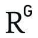

::: {.cv-header}
{.profile-photo}

::: {.cv-header-text}
::: {.cv-name}
Chansu Han, Ph.D.
:::

::: {.cv-role}
Researcher, NICT, Japan
:::

::: {.cv-affiliation}
Center for Research on AI Security and Technology Evolution (CREATE),
National Institute of Information and Communications Technology (NICT)
:::

::: {.cv-role-sub}
Visiting Assistant Professor, Kyushu University
:::

::: {.cv-contact}
**Contact:** han (at) nict.go.jp
:::

::: {.cv-links}
[{.link-icon} Google Scholar](https://scholar.google.com/citations?user=ZvvIWZ4AAAAJ&hl=en) ·
[{.link-icon} ResearchGate](https://www.researchgate.net/profile/Chansu-Han-2) ·
[{.link-icon} dblp](https://dblp.org/pid/186/6829.html)

[{.link-icon} Semantic Scholar](https://www.semanticscholar.org/author/Chansu-Han/3467047) ·
[{.link-icon} Web of Science](https://www.webofscience.com/wos/author/record/K-3263-2019)

[{.link-icon} ORCID: 0000-0002-1728-5300](https://orcid.org/0000-0002-1728-5300) ·
[{.link-icon} LinkedIn](https://www.linkedin.com/in/chansu-han-aa0857193/)
:::

::: {.cv-download}
[View full CV](cv/index.qmd){.btn-pdf} [Download CV (PDF)](cv/Chansu_Han_CV.pdf){.btn-pdf target="_blank"}
:::
:::
:::

## Research Topics

- **Security for AI / LLM Safety**
  - Safety assessment of fine-tuned open-source LLMs
  - Construction of LLM security benchmarking environments
  - Development of benchmark datasets for LLM safety evaluation
- **AI for Security (Network Analysis, Malware Analysis)**
  - Early detection of malware activities and tracking of coordinated scanners
  - Development of explainable network intrusion detection systems, and alert analysis
  - Fast clustering of large-scale IoT malware and behavior analysis of variants

## Biography

Chansu Han received his B.E. degree in computer science, and M.S. and Ph.D. degrees in informatics engineering from Kyushu University in 2016, 2018, and 2021, respectively. Since 2025, he has been a researcher at the Center for Research on AI Security and Technology Evolution (CREATE), National Institute of Information and Communications Technology (NICT), Japan. He is also concurrently affiliated with the Cybersecurity Laboratory, NICT, which he initially joined in 2018. Additionally, he has served as a Visiting Assistant Professor at Kyushu University since 2023. His research interests span cybersecurity and AI security, including large language model (LLM) safety, anomaly detection, and network/malware analysis.

## Featured Publications

- J. Kim, H. Lee, S. Hong, T. Takahashi, **C. Han**, T. Morikawa, and S. Choi, “Don't Trust the AI Ecosystem: Analyzing Privacy Leakage in Compromised Open-Source Components,” *ACM CCS*, Nov 2026. **(Tier 1)**
- K. Nikawa, **C. Han**, A. Tanaka, K. Iwamoto, T. Takahashi, and J. Takeuchi, “Improving Scalable Clustering for IoT Malware via Code Region Extraction,” *The 28th Annual International Conference on Information Security and Cryptology (ICISC)*, Nov 2025. **(Tier 3)** [[DOI]](https://doi.org/10.1007/978-981-95-8034-7_5)
- K. Ma, **C. Han**, A. Tanaka, T. Takahashi, and J. Takeuchi, “Towards Architecture-Independent Function Call Analysis for IoT Malware,” *Information Security Conference (ISC)*, Oct 2025. **(Tier 3)** [[DOI]](https://doi.org/10.1007/978-3-032-08124-7_21)
- K. Abduaziz, **C. Han**, and J. Shin, “Semi-supervised Traceability Analysis of Investigative Scanners of Darknet Traffic,” *Computers & Security*, Dec 2025. [[DOI]](https://doi.org/10.1016/j.cose.2025.104681)
- Y. Chang, H. Chen, **C. Han**, T. Morikawa, T. Takahashi, and T. Lin, “FINISH: Efficient and Scalable NMF-based Federated Learning for Detecting Malware Activities,” *IEEE Transactions on Emerging Topics in Computing (TETC)*, Jul 2023. [[DOI]](https://doi.org/10.1109/TETC.2023.3292924) [[PDF]](https://ieeexplore.ieee.org/stamp/stamp.jsp?tp=&arnumber=10179267)
- **C. Han**, J. Takeuchi, T. Takahashi, and D. Inoue, “*Dark-TRACER*: Early Detection Framework for Malware Activity Based on Anomalous Spatiotemporal Patterns,” *IEEE ACCESS*, Jan 2022. [[DOI]](https://doi.org/10.1109/ACCESS.2022.3145966) [[PDF]](https://ieeexplore.ieee.org/stamp/stamp.jsp?tp=&arnumber=9690867) [[Related Slides]](https://drive.google.com/file/d/1IlOar4ARu-olK4k-b5g6WWC4Id2abfnB/view?usp=sharing) [[Datasets]](https://csdataset.nict.go.jp/darknet-2022/) [[Codes]](https://github.com/Gotchance/Dark-TRACER)
- **C. Han**, J. Takeuchi, T. Takahashi, and D. Inoue, “Automated Detection of Malware Activities Using Nonnegative Matrix Factorization,” *IEEE International Conference on Trust, Security and Privacy in Computing and Communications (TrustCom)*, Oct 2021. **(Tier 3)** [[DOI]](https://doi.org/10.1109/TrustCom53373.2021.00085) [[PDF]](https://www.researchgate.net/publication/359121104_Automated_Detection_of_Malware_Activities_Using_Nonnegative_Matrix_Factorization)
- R. Kawasoe, **C. Han**, R. Isawa, T. Takahashi, and J. Takeuchi, “Investigating Behavioral Differences between IoT Malware via Function Call Sequence Graphs,” *Proceedings of the 36th ACM/SIGAPP Symposium on Applied Computing (SAC)*, 2021. **(Tier 3)** [[DOI]](https://doi.org/10.1145/3412841.3442041) [[PDF]](https://dl.acm.org/doi/pdf/10.1145/3412841.3442041)
- **C. Han**, J. Shimamura, T. Takahashi, D. Inoue, M. Kawakita, J. Takeuchi, and K. Nakao, “Real-Time Detection of Malware Activities by Analyzing Darknet Traffic Using Graphical Lasso,” *IEEE International Conference on Trust, Security and Privacy in Computing and Communications (TrustCom): Security Track*, 2019. **(Tier 3)** [[DOI]](https://doi.org/10.1109/TrustCom/BigDataSE.2019.00028) [[PDF]](https://www.researchgate.net/publication/336946818_Real-Time_Detection_of_Malware_Activities_by_Analyzing_Darknet_Traffic_Using_Graphical_Lasso)
